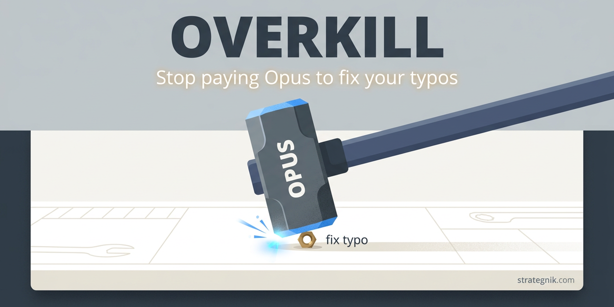

# overkill

<p align="center">
  
</p>

**Stop paying Opus to fix your typos.**

`overkill` is a model router for [Claude Code](https://claude.com/claude-code). It runs a
cheap, capable model by default, judges each task as it reads it, and escalates to a more
powerful model only when the work warrants it — so your spend tracks the difficulty of
the problem, not a flat top-tier rate.

Set once in `~/.claude/`, inherited by every project, overridable per repo. No proxy, no
extra service — just config.

---

## The idea

Claude Code fixes one model per session — **it cannot downgrade itself mid-task.** The
only native mechanism for "use the right model for the job" is a *router that delegates
to model-pinned subagents.* This repo is that router, expressed as config:

| Tier | Model | For |
|------|-------|-----|
| **Default / router** | Sonnet | Everyday work, *and* deciding what to delegate |
| **`quick`** | Haiku | Mechanical, self-verifying tasks (copy, renames, lookups) |
| **`deep-work`** | Opus | Hard reasoning — optimization, architecture, subtle bugs |

The Sonnet session classifies each task *inline* as it reads it — no separate classifier
call, no latency tax — and hands the tails off to the right subagent.

## How it works (and what Claude Code can / can't do)

It helps to know exactly where the seams are, because they shape the design:

- **The router is the working model, not a separate step.** Sonnet has to read your
  prompt anyway; judging difficulty is one beat of that same read. So classification is
  effectively *free* — there is nothing faster to optimize here. (A dedicated classifier
  call, even on Haiku, would be *slower* — it adds a round-trip.)
- **Hooks can't switch the model.** No hook output field changes the active model; the
  session model is set at launch or via `/model`. So routing has to be a model-or-human
  decision, not a deterministic pre-pass. That's why this is a rubric, not a script.
- **Delegation has real overhead.** A subagent runs in a fresh context with no cache
  carryover — a genuine latency/cost hit. This is the cost that actually matters, and it
  drives the rules below.

## Three design decisions worth stealing

**1. Optimize for error cost, not token price.** The dominant cost in this system isn't
per-token rates — it's a *subtly-wrong answer you have to catch and redo.* That cost is
asymmetric: a wrong headline is cheap and instantly visible; a plausible-but-broken
optimization can cost hours. So: push trivial work down aggressively (errors are cheap
there), pay for the best model on hard work (errors are expensive there), and **when
unsure, round up.**

**2. Escalate reactively, not predictively.** Difficulty is usually only knowable once
you're in the work. The rubric tells Sonnet to *start* the task and escalate to
`deep-work` the moment the problem proves hard — or its own confidence drops — rather
than forecasting difficulty at t=0. The breakpoint becomes measured, not guessed.

**3. Delegate down only at volume.** Because spawn overhead is real, handing a *single*
one-line edit to Haiku is net-negative — Sonnet doing it inline is faster. The `quick`
tier earns its keep on **volume** (a batch of edits, a long mechanical grind), not tiny
one-offs. The asymmetry runs both ways: escalate *up* freely (hard-task error cost
dominates the spawn), delegate *down* only when the batch justifies it.

**Why three tiers, not four?** It's tempting to split the top tier (e.g. Opus 4.6 vs
4.8). Don't. The boundary between two same-class models is the *hardest* call for the
router and saves the *least* money — the worst margin to maintain. The valuable cliffs
are trivial↔standard (~3×) and standard↔hard (~5×). Tier those; ignore the rest.

## The one honest limitation

Subagents run to completion in isolation — you can't steer them mid-stream. So
`deep-work` is great for **sealed, well-scoped** hard tasks ("optimize this function,
return the diff") and worse for **collaborative, exploratory** ones ("let's rethink this
architecture together"). For the latter, the rubric tells Sonnet to recommend you switch
the *session* to Opus (`/model opus`) instead of delegating blind. Reactive escalation
handles sealed hard tasks; it can't make a subagent feel interactive.

## Install

```bash
git clone https://github.com/Strategnik/overkill.git
cd overkill
./install.sh
```

The installer:
- copies `deep-work` and `quick` into `~/.claude/agents/`
- sets the pinned Sonnet (`claude-sonnet-4-6`) as your default (only if you haven't already chosen one)
- appends the routing rubric to `~/.claude/CLAUDE.md` (idempotent, marker-guarded, backs up first)

Then start a new session. Honors `$CLAUDE_CONFIG_DIR` if you keep config elsewhere.

### Manual install
1. Copy `agents/*.md` → `~/.claude/agents/`
2. Add `"model": "claude-sonnet-4-6"` to `~/.claude/settings.json`
3. Paste `CLAUDE.routing.md` into `~/.claude/CLAUDE.md`

## Customize

- **Swap models** in the `model:` frontmatter of `agents/*.md`. This repo **pins specific
  tested versions** (full model IDs), not floating aliases — deliberate model choice is
  the whole point, so a new release never silently takes over a tier. See
  [MODELS.md](MODELS.md) for the current pins and the upgrade ritual to run when a new
  model ships.
  - ⚠️ Gotcha: the `CLAUDE_CODE_SUBAGENT_MODEL` env var, if set, **overrides every
    subagent's `model:` frontmatter** globally. Unset it for this routing to work.
- **Change the default floor** in `settings.json` — e.g. main-on-Opus with downward
  delegation if you'd rather have a smarter router and accept a higher base cost.
- **Tune the rules** between the `<!-- BEGIN/END overkill -->` markers in your
  `CLAUDE.md`.
- **Override per project** by dropping a `.claude/settings.json` in any repo — it beats
  the user-level default.
- **Pairs well with `opusplan`:** if you use plan mode, that built-in alias runs Opus
  while planning and Sonnet while executing — free, and complementary to this tiering.

## If you want *true* automatic routing

This setup is the best you can do **inside Claude Code**, where the model is a session
property a model or human chooses. If you want a deterministic router — code that
inspects each request and executes it on a chosen model with nothing in the loop — that
lives *outside* Claude Code: build it on the [Claude Agent SDK](https://docs.claude.com/en/api/agent-sdk),
where model is a per-request parameter and your script owns the routing logic. That's a
proxy/wrapper, not a config drop-in — more power, more to maintain. For most people, the
config approach here is the right altitude.

If you do want to build it properly, **[AGENT.md](AGENT.md)** explains the design — why
the elegant pattern is *reactive escalation gated by a cheap verifier* rather than upfront
classification — and **[`sdk/escalating_agent.py`](sdk/escalating_agent.py)** is a runnable
reference sketch.

## License

MIT
